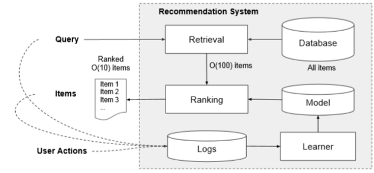
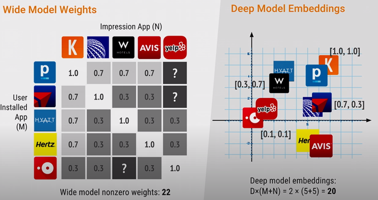
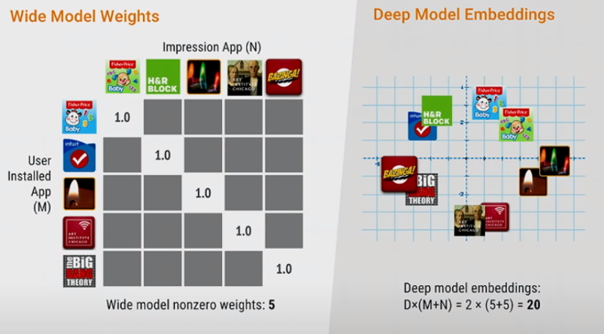
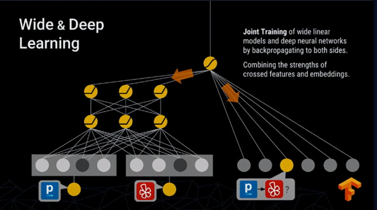
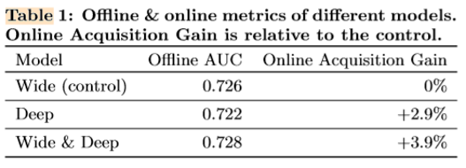

   
첫 포스팅으로 Google에서 발표한 Wide & Deep에 관해 리뷰 해보려 한다.    
 

# Overview

우선 이 모델이 System의 어떤 부분에 이용되는 보기 위해 전체 System을 살펴보겠다.

1. User Query : User가 검색 혹은 구매 등 Action을 취한다.
2. Retireval Candidates : User에 맞는 item 후보군을 선정한다.
3. Rank & Recommend : 후보군에 Score를 주고 item을 user에게 추천해준다.
4. Log : User의 Action을 기록하고 추후의 Recommend System에 반영한다.

이 전체 구조중 본 논문에서 소개하는 모델은 Rank를 매기는 부분에 이용된다.  
    

# Generalization vs Memorization

Wide&Deep 모델은 Generalizaion과 Memorization이라는 두가지 특성을 모두 가지기 위해 제시되었다. 이는 인간의 학습과정과 매칭시켜 생각해볼 수 있다.  

사람은 여러 새들을 보며 "날개가 달린 동물은 날 수 있다"라는 개념을 학습한다.  
지구상의 모든 새들을 모두 확인할 수 없기 때문에 이러한 일반화(Generalization)을 하는 학습과정은 필수적이다.  

하지만 일반화만 한다면 펭귄과 같은 동물은 날 수 없기 때문에 오류를 범할 수 있다. 따라서 독수리, 펭귄등을 학습하며 "독수리는 날수있지만, 펭귄은 날 수 없다."라는 기억(Memorization)을 해야한다.  

이렇게 일반화와 기억 이 두가지가 합쳐져서 "날개가 달린 동물은 날 수 있지만 펭귄은 날 수 없다"라는 참인 명제를 학습 할 수 있다.  Wide&Deep Model에서 Wide model은 Memorization, Deep model은 Generalization에 대응된다.
    

# Wide Model / Deep Model

## 1) Wide Model

Input : $$ [x, \phi(x)] $$  
Cross : $$ \phi_k(x) = \prod_{i=1}^d{x_i^{c_{ki}}},    c_{ki}\in  \{0,1\} $$

Wide model은 대표적으로 logistic Regression을 생각할 수 있다.  

여기서 input값에 주목할 필요가 있다. 
x는 feature를 그대로 사용하는 것이고  
$$\phi(x)$$는 몇개의 feature를 cross하여 사용한다는 뜻이다. x는 그 feature의 bias한 특성, crossed feature는 몇가지 feature들의 interaction을 반영한다고 해석할 수 있다.  

Netflix에서 user가 영화에 Rating을 매기는 상황을 예를 들어 설명해보겠다.  
feature로 [user_age = 20~30]와 [movie_name = Starwars]가 있다고 생각하자. 만약 20대의 유저들이 평균적으로 높은 Rating을 준다면 [user_age = 20~30]에 높은 가중치를 부여해야 할 것이다.
그리고 Starwars 영화가 평균적으로 낮은 Rating을 받는다면 [movie_name = Starwars]에는 낮은 가중치가 부여될 것이다. 따라서 input에서 x에 해당하는 부분은 그 각각의 feature의 bias한 특성을 반영한다고 할 수 있다.  

이 예에서 crossed_feature는 [user_age=20~30, movie_name=Starwars]가 될 것이다. 이는 20대인 user가 Starwars에 어떤 Rating을 주는지로 해석할 수 있을 것이다.
따라서 이런 crossed_feature는 특정 상황에 대한 history를 기억하고 있다고 볼 수 있다. 즉 Memorization특성을 가지고 있는 것이다.

## 2) Deep Model

Deep Model은 일반적인 DNN(Deep Neural Network)을 생각하면 된다. 여기서 특징은 각각의 feature를 low-dimensional space에 Embedding시켰다는 점이다.  

Netflix예를 다시 들자면 user와 movie를 latent feature를 만들어 학습시켰다고 생각할 수 있겠다. 이 방식은 과거 history에 없던 상황이 input으로 주어져도 예측할 수 있기에
Generalization특성이 있다고 볼 수 있다.  
    

# Dense / Sparse Dataset

## 1) Dense Dataset

Wide model과 Deep model이 각각 어떤 상황에 이점이 있는지 살펴보기 위해 극단적인 두가지 예를 살펴보겠다.  

위 경우는 Data가 많은 즉 dense한 Dataset이다.  
이 경우 모든 상황에 관한 정보를 기억하고 있는다면 왼쪽 위 그림과 같이 아주 많은 weight parameter를 기억하고 있어야 할 것이다.(위 예시는 feature가 10개 뿐이지만 100개만 된다고 하더라도 아주 많아질 것이다.)  

하지만 Data가 많은 경우 각각의 feature를 embedding시킨다면 저차원의 공간에서도 유사한 feature들을 비슷한 위치에 embedding시킬 수 있을 것이다. 따라서 위 경우에는 Deep Model의 성능이 더 좋다.

## 2) Sparse Dataset

이번에는 data가 많이 없는 sparse한 case를 보겠다. 이런 경우는 niche한 취향을 가지고 있는 user의 경우를 상상해볼 수 있겠다. 이렇게 Data가 적은 경우 저차원공간에 Embedding시키기는 현실적으로 힘들 것이다. 따라서 각각의 관련도가 높은 interaction을 기억하고 있는 Wide model의 성능이 더 좋다.  

짧게 정리해보자면 Data가 많은 경우에는 Deep Model,  
niche한 특성을 예측하기 위해서는 Wide Model이 유리하다.  
    

# Wide&Deep Model
  

Prediction : $$ P(Y=1\mid x) = \sigma(w^T_{wide}{[x,\phi(x)]}+w^T_{deep}a^{(l_f)}+b) $$

드디어 Wide&Deep 모델을 살펴보겠다. 사실 사전설명이 긴 것에 비해 내용은 매우 간단하다. Wide model과 Deep model을 합쳐서 Joint Training시키는 것이다.  

저자는 Ensemble Training이 아니라 Joint Training이라는 점을 강조하고 있는데 Ensemble방법의 경우 머신러닝을 조금 공부해본 사람이라면 자주 접해봤을 것이다.  
여러 모델을 독립적으로 학습시키고 다수의 모델의 결과값을 반영하여 prediction하는 방식인데 이와 달리 Joint training은 학습과정에서 두 모델을 한번에 학습시킨다는 특징이 있다.  

논문에서는 Joint Training을 할 경우 학습과정에서 두 모델이 동시에 Optimize되기 때문에 더 좋은 결과값을 낸다는 것을 실험을 통해 관측하였다고 한다.
    

# Experiments

Google Play에 적용시킨 결과이다. Wide Model로는 Logistic Regression, Deep Model로는 DNN을 사용하였고 예상대로 AUC, Acquisition Gain에서 모두 단일 모델에 비해 좋은 결과를 보였다.  

개인적으로 MovieLens Dataset을 이용하여 구현해보았는데 github링크를 첨부하겠다.  

[MovieLens-Wide&Deep](https://github.com/LJS-Student/RecommendSystem/tree/main/Wide_n_Deep)
    

# 정리   

구조는 매우 간단한 모델이였던 것 같고 Memorization과 Generalization특성을 반영하기 위해 Wide Model과 Deep Model을 Joint Training했다고 요악할 수 있겠다.  

간략하게 기록용으로 정리하려고 했는데 첫 포스팅이다 보니 길게 쓰게되어 작성하는데 시간 소요가 컸다. 다음 포스팅부터는 더 요약해서 기록하겠다. 